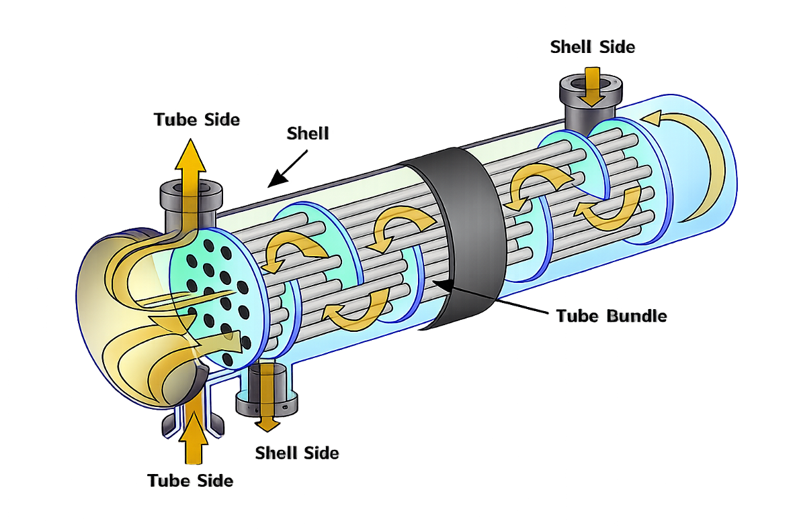

# Bibliotecas Fundamentais de Python

**PhD. Julles Mitoura** · FIAP Pós-Graduação

---

## Problema de Negócio

Trocadores de calor são equipamentos críticos em plantas industriais: respondem pela transferência de energia térmica entre fluidos e operam continuamente, muitas vezes sem janelas fáceis para manutenção. Com o desgaste, incrustações, corrosão interna e degradação dos materiais, a **eficiência térmica cai progressivamente** — e quando ela atinge o limite mínimo operacional, a planta pode ser forçada a parar de emergência, gerando prejuízos elevados.

  
  
<em>Trocador de calor de casco e tubos — equipamento monitorado neste projeto</em>

O desafio central é: **como prever com antecedência o momento em que o equipamento precisará de manutenção?**

---

## O Dataset

O dataset `heat_exchanger.csv` contém **175 registros diários** de operação, cobrindo o período de setembro de 2025 a março de 2026.

| Variável | Unidade | Descrição |
|---|---|---|
| `timestamp` | data | Data do registro |
| `t_water_in` | °C | Temperatura de entrada da água de resfriamento |
| `t_glycol_int` | °C | Temperatura de entrada do glicol (fluido quente) |
| `t_glycol_out` | °C | Temperatura de saída do glicol |
| `t_water_out` | °C | Temperatura de saída da água aquecida |
| `efficiency` | % | Eficiência térmica calculada pelo balanço de energia |

A **eficiência térmica** é calculada pela fórmula:

$$\eta = \frac{T_{\text{água saída}} - T_{\text{água entrada}}}{T_{\text{glicol entrada}} - T_{\text{água entrada}}} \times 100$$

Ela representa a fração do potencial máximo de transferência de calor que o equipamento efetivamente realiza. No início da operação, a eficiência era de **96,45%**; ao final do período monitorado, havia caído para **93,23%**.

---

## Por que predizer a eficiência?

### Impacto operacional

| Cenário | Consequência |
|---|---|
| Manutenção reativa (após falha) | Parada não programada, custo 3–5× maior |
| Manutenção preventiva baseada em dados | Janela de manutenção planejada, menor perda de produção |
| Sem modelo preditivo | Decisão baseada em calendário fixo, frequentemente incorreta |

### Por que modelos de predição são interessantes?

1. **Antecipação**: o modelo linear ajustado neste projeto mostra que o limite de 90% será atingido no **dia 342 de operação** (≈ setembro de 2026). Sem esse modelo, a equipe de manutenção não teria base quantitativa para planejar a intervenção.

2. **Otimização de recursos**: uma manutenção planejada com 4–6 semanas de antecedência permite negociar paradas com a produção, pré-comprar peças e alocar mão de obra especializada.

3. **Base para modelos mais sofisticados**: o modelo linear é um ponto de partida. Com mais dados e variáveis (pressão diferencial, vibração, análise de fluido), modelos de Machine Learning podem capturar padrões não lineares e multivariadoss — aumentando ainda mais a precisão da predição.

4. **Generalização**: a mesma abordagem se aplica a bombas, compressores, fornos, motores e qualquer equipamento que apresente degradação mensurável ao longo do tempo.

---

## Estrutura do Módulo

| Notebook | Conteúdo |
|---|---|
| [01_pandas.ipynb](01_pandas.ipynb) | Leitura, limpeza, transformação e agrupamento com Pandas |
| [02_numpy.ipynb](02_numpy.ipynb) | Arrays, operações vetorizadas e regressão linear com NumPy |
| [03_projeto.ipynb](03_projeto.ipynb) | Relatório integrador: EDA completa + modelo preditivo + respostas de negócio |

---

## Resultados do Modelo

O modelo de regressão linear ajustado com NumPy (`np.polyfit`) sobre os 175 dias de operação apresentou:

- **R² = 0,9977** — 99,77% da variância da eficiência é explicada pelo tempo de operação
- **Taxa de decaimento** = −0,01856% por dia (≈ −0,56% por mês)
- **Q1**: o limite de 90% será atingido no **dia ~342** (≈ 06/Set/2026)
- **Q2**: a eficiência estimada no **dia 310** é de **≈ 90,60%**

---

*Materiais desenvolvidos para a disciplina de Pós-Graduação: FIAP, 2026.*
